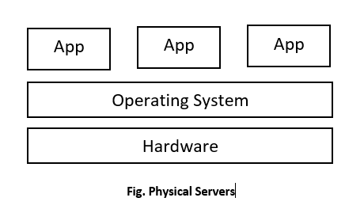
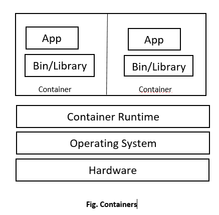
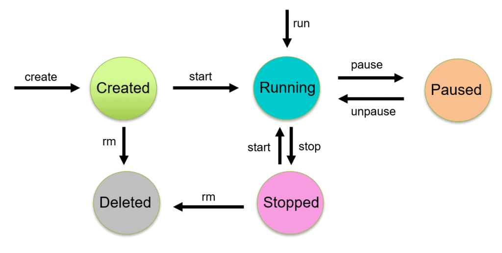

# Docker入门教程

## 虚拟化技术

虚拟化技术从1960年代诞生，到2000年左右成为技术产品开始蓬勃发展，比如VMWare, VirutalBox, KVM等。

目前大家熟知的虚拟化技术包括虚拟机(VM)和容器(Container)。

虚拟机技术促进了云计算的发展，让云计算厂商可以提供大量机器实例给到用户。

容器技术促进了云原生的发展，让运行在云环境的应用可以更好地享受云的优势。

从传统的物理机，到进化的虚拟机，各自的逻辑架构如下所示：




虚拟机技术里的`Hypervisor`有2种类型：

* 第一种：直接和硬件交互，不经过宿主机操作系统，比如HyperKit(Mac OSX)，Hyper-V(WIndows)，KVM(Linux)。

* 第二种：宿主机操作系统上的一个应用，上面虚拟机示意图表示的是这个类型的`Hypervisor`，比如VirtualBox/VMWare。

  

## Docker是什么

Docker没有严格的定义，Docker本质上是利用容器虚拟化技术，让开发者可以将他们的应用、依赖库和配置文件打包到一个可移植的镜像文件里，然后发布到任何流行的Linux机器上运行。

运行这个镜像文件会生成一个虚拟容器，应用程序在这个容器里运行，就好像在真实的物理机上运行一样。

**容器化技术和Docker不能划等号**，最早的容器技术是2008年发布的LXC(Linux Container)，但是不够好用，Docker基于LXC做了很多对应用开发友好的封装和改进，真正带动了容器化技术的流行。

后面随着Docker自身的技术架构演进，放弃了使用LXC，转而使用自研的`libcontainer`来和Linux kernel交互，后面`libcontainer`为了符合`OCI(Open Container Initiative)`标准，又封装重构为现在著名的`runC`。

Docker使用Go语言编写，底层实现上使用`Namespace`实现容器之间的资源隔离，使用`cgroups(Control Groups)`做资源限制。

容器技术的逻辑逻辑架构如下所示：



**容器是被隔离的进程(isolated process)，不要把容器理解为轻量级虚拟机，容器和虚拟机是2种完全不同的虚拟化技术。**

`Container Runtime`：表示容器运行时，任何满足OCI标准的`容器运行时`都可以互相替换，就类比虚拟机里的Hypervisor也有VMWare和VirtualBox等不同的实现。目前最流行的容器运行时是由Docker捐献给CNCF的`runC`。

Docker实现的容器技术和传统的虚拟机相比，除了有上面说的架构上的区别，其它区别如下：

| 特性      | Docker                   | 虚拟机     |
| --------- | ------------------------ | ---------- |
| 启动速度  | 秒级                     | 分钟级     |
| 交付/部署 | 开发，测试，生产环境一致 | -          |
| 性能      | 近似物理机               | 性能损耗大 |
| 镜像大小  | 较小，KB-MB              | 较大，GB   |
| 迁移/扩展 | 跨平台，可复制           | -          |


## Docker架构

Docker是c/s架构，架构图如下：


`Docker daemon`：简称`dockerd`，作为服务端，处理Client发过来的请求，管理Docker镜像、容器、网络和存储。

`Docker client`: 作为客户端和`dockerd`服务端交互，使用的是RESTful API。docker命令行工具CLI和带界面的docker客户端都可以称为Docker client。Docker client可以和多个dockerd交互。

`Docker Registry`：镜像仓库，用来存储Docker镜像，有公共仓库(public registry)和私有仓库(private registry)，类似GitHub的Public Repo和Private Repo。使用`docker pull`或`docker run`命令时，会从我们配置的registry仓库拉取镜像。使用`docker push`命令，会把镜像推送到我们配置的registry仓库。

`Docker images`： Docker镜像，是一个只读文件，里面有创建Docker容器的指令。一个镜像可以基于其它镜像来创建，比如我们可以基于已有的`ubuntu`镜像，添加Nginx和自己的应用程序来创建一个新的镜像。如果要创建自己的镜像文件，需要创建名为Dockerfile的文件，在该文件里按照指定的语法规则来定义创建和运行镜像文件的步骤。

`Docker containers`：Docker容器，是镜像的运行实例，一个容器实际上就是一个被隔离的进程(isolated process)。Docker容器的生命周期如下图所示：



`Docker Engine`：包含有Docker daemon, RESTful API, Docker CLI。


## Docker安装

安装Desktop即可，Desktop支持Mac, Windows和Linux系统，包含了使用Docker所需要的一切工具集。

安装步骤参考：https://docs.docker.com/get-docker/


## Docker使用

我们以官方的教学镜像作为简单示例。启动Desktop后，在电脑的终端上运行如下命令：

```bash
docker run -d -p 80:80 docker/getting-started
```

该命令如果发现本地没有`docker/getting-started`镜像文件，会从官方的镜像仓库Docker Hub上拉取镜像并运行。

`-d`: 让容器以后台模式运行。

`-p 80:80`：把主机的80端口映射到容器里的80端口。

`docker/getting-started`：镜像名称。

启动后，打开一个浏览器，访问 http://localhost/ 就可以看到已经run起来的应用程序的界面了。


## 开源地址

文章和示例代码开源地址在GitHub: https://github.com/jincheng9/disributed-system-notes

公众号：coding进阶

个人网站：https://jincheng9.github.io/


## References

* https://docs.docker.com/
* https://mp.weixin.qq.com/s/ji0Pj00xeHOeispNhsPKZw
* https://www.tutorialworks.com/difference-docker-containerd-runc-crio-oci/